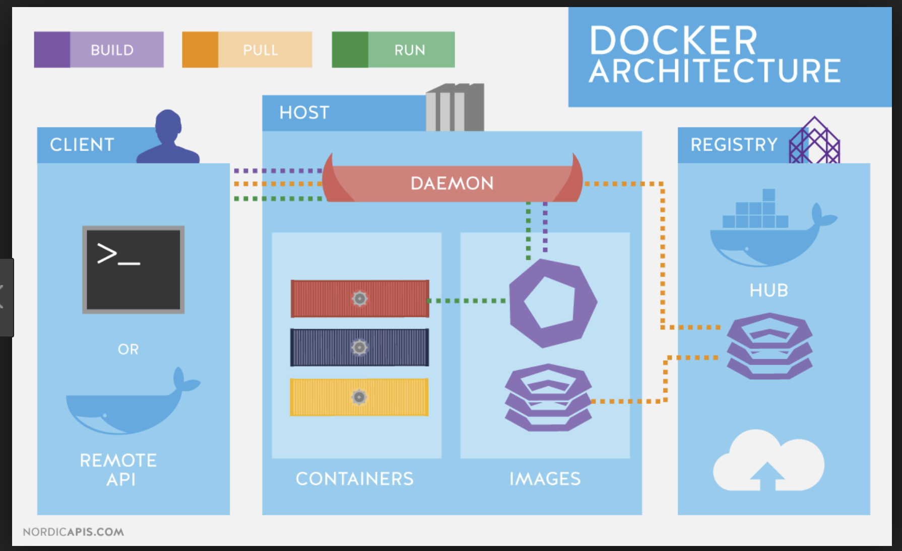

CONTAINERIZATION WITH DOCKER AND DOCKER COMPOSE
============
Container Basics
-------------
An application container is a stand-alone package for a software application that comprises of application binaries, software dependencies and the hardware requirements needed to run the application in a single unit

Why Containers
-------------
* The container works as a self isolated unit that can run anywhere that supports it
* The container retains it's identity regardless of the operating system it is running on. This helps ensure that the container will run on different servers.
* Containers implement micro service architecture, where each microservice comprises of a number of containers, both master and slave.This makes application deployment easy by the engineering teams.

Docker as a containerization tool for the Store manager Application
------------
Docker is one of the most widely used containerization technologies because it is open source and works across a number of platforms.
--------  -----------------------
The Docker Architecture
--------  -----------------------


The Docker architecture uses a client-server model and comprises of the Docker Client, Docker Host, Network and Storage components, and the Docker Registry/Hub. 

The Docker Client
-----------------
The Docker client enables users to interact with Docker. The docker client is used in the terminal to interact with the Converge application.
The docker client allows the user to run commands such as:
* docker build
* docker pull
* docker run
* docker create
* docker stop

The DockerHost
------------------
The Docker host provides a complete environment to execute and run applications. It comprises of the Docker daemon, Images, Containers, Networks, and Storage.
The daemon is responsible for all container-related actions and receives commands via the CLI or the REST API. 

How the Docker Daemon is used in Converge
When a user types `docker run command` to start up the container from the converge docker image, the docker client  translates that command into http API call, sends it to docker daemon which then evaluates the request, talks to underlying operating system and provisions the container.

Secondly, the Docker daemon pulls and builds container images as requested by the docker client. Once the image is pulled, a working model for the container is built through  using a set of instructions callled the build file.

A user runs the `docker build command` using the docker client to generate an image from the docker file.
The created image can still be viewed by running `docker images` in the docker client
The docker image is an inert, immutable, file that's essentially a snapshot of a container created with the build command, and produces a container once started.

The Docker Registry
-------------------
Once the image is created, it is stored in a Docker registry such as `registry.hub.docker.com` `and gcr.io`
The registry is an open source and highly scalable server side application that stores and lets one distribute docker images.

USING DOCKER COMPOSE
============
Docker Compose can run on macOS, Windows, and 64-bit Linux.

Docker Compose relies on Docker Engine therefore there is need to install Docker Engine first.

Install Compose on macOS
Docker Desktop for Mac and Docker Toolbox already include Compose along with other Docker apps, so Mac users do not need to install Compose separately. Docker install instructions for these are [here](https://docs.docker.com/docker-for-mac/install/):

Verify installation of docker-compose
- docker-compose --version

Add a Docker file to your project
Below is an example of a docker file for a python project
```
FROM python:3.4-alpine
ADD . /code
WORKDIR /code
RUN pip install -r requirements.txt
CMD ["python", "app.py"]
```
Create a docker-compose.yml file and define the services there as shown in the example below
```
version: '3'
services:
  web:
    build: .
    ports:
     - "5000:5000"
  redis:
    image: "redis:alpine"
```

The compose file above runs two services: the web and the redis service.
Note the redis service pulls it's image from aremote registry

Start the application by running `docker-compose up`

RUNNING THIS PROJECT
- Start by clonning this repository using ``
- Navigate into the `` folder
- Run `docker-compose up ` to run the application